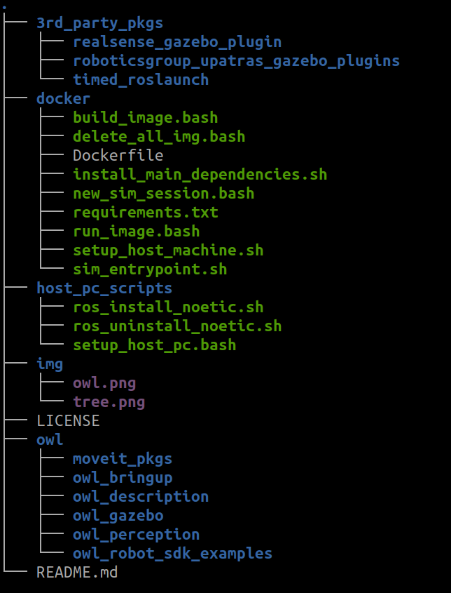
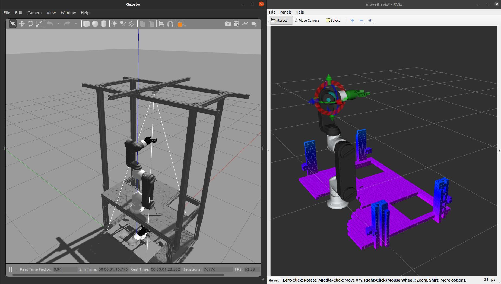

# Orangewood Simulation Stack

This repository has a simulation packages and MoveIt! config of Orangewood indigenous OWL 6.5 Robot. It is also including orangewood sdk examples.


# Setting Orangewood simulation 

We have two methods to test and work with simulation. 

* Setup in your host Ubuntu 20.04.6 machine 
* Setup  in [Docker](https://www.docker.com/). 

If you want to setup in host PC, you can follow this instruction.

**Note: If you want to install Docker and run simulation, jump to the last section.**


## 1) Setting Simulation in HOST PC

### Prerequisites

Here are the prerequisites to run this Gazebo simulation

* [Ubuntu 20.04.6 LTS](https://releases.ubuntu.com/focal/)
* [ROS Noetic Full Desktop Full](https://wiki.ros.org/noetic/Installation/Ubuntu) , you can also use [Single line installation](https://github.com/qboticslabs/ros_install_noetic) which is given below


ROS Noetic Single line installation
```
wget -c https://raw.githubusercontent.com/orangewood-co/orangewood_sim_stack/main/host_pc_scripts/ros_install_noetic.sh && chmod +x ./ros_install_noetic.sh && ./ros_install_noetic.sh
```

After installing ROS Noetic in the host PC, we can setup a ROS workspace to build the sim packages.


```
mkdir -p ~/orangewood_ws/src

cd ~/orangewood_ws/src

git clone https://github.com/orangewood-co/orangewood_sim_stack.git

cd ~/orangewood_ws

#Installing depdencies 

rosdep install --from-paths src --ignore-src -r -y

#Building packages

catkin_make -j1

echo "source ~/orangewood_ws/devel/setup.bash" >> /home/$USER/.bashrc

source /home/$USER/.bashrc
```

### Repository File Structure




# Running instruction: OWL 6.5 Robot
After setting the repository, you can run the Gazebo simulation

**Terminal 1:**

Eg. Start Gazebo simulation of OWL 6.5 + Robotiq 2F 85 Gripper

```
roslaunch owl_bringup bringup.launch gripper:=robotiq2f85 world:=table  camera:=on sim:=on time:=5
```

Here are the list of options for the gripper: 

1) pneumatic 
2) vacuum
3) robotiq2f85

Here are the list of options for the world: 

1) empty
2) stand
3) table

Here are the options for the camera

1) on
2) off

Here are the options for sim. This option enable or disable Gazebo and only run MoveIt config in fake mode

1) on
2) off


Here are the options for time. 

This time is when to start MoveIt config after launching the simulation. If you don't want Gazebo simulation, you can set sim as "off" and time as 0. If you are starting simulation, better to have a value from 5 to 10. The value is in sec. 


#

# Setting OWL Robot SDK 

The OWL Robot SDK is simple API built on moveit_commander module from MoveIt. The APIs enable the developers to quickly test their application by not understanding core MoveIt APIs

## Installing OWL Robot SDK

The following command can install OWL Robot SDK

```
pip install owl-robot-sdk
```

## API Documentation

Click here to view the current [API documentation](docs/api_docs.md)


## Run example of OWL Robot SDK

**Note: Make sure you are running, gazebo with MoveIt using above commands**, if it is running, navigate to


*orangewood_simstack/owl/owl_robot_sdk_examples/api_test.py*

Run it using following command

```
python3 api_test.py
```

You can see various test being performed. If there is any failure, report to developers


## 2) Setting Orangewood simulation on Docker

In order to setup Docker in your machine, first clone the orangewood simstack in your host machine


```
mkdir -p ~/orangewood_ws/src

cd ~/orangewood_ws/src

git clone https://github.com/orangewood-co/orangewood_sim_stack.git

cd ~/orangewood_ws/src/orangewood_simstack/docker/
```

## Install Docker in Host Machine

```
orangewood_simstack/docker$ ./setup_host_machine.sh
```

It will take some time to install Docker and NVIDIA Container toolkit

After installing everything, do a REBOOT of your PC

## Build/Pull Docker Image of Orangewood Simulation

We have two option to get the docker image for simulation, 

1) Building a new image
2) Download/Pull an image from Docker Hub.

Building a new docker image will take time, if you have good configuration PC, you can do that, othervice you can go with pulling from docker hub. It require ~4GB of download


1) Building a new Image
```
orangewood_simstack/docker$ ./build_image.bash
```

2) Pulling existing image from [Docker Hub](https://hub.docker.com/r/orangewoodlabs/orangewood_sim)

```
docker pull orangewoodlabs/orangewood_sim
```

## Run Docker for running simulation

After building/downloading image, you can run it using following command
```
#For build image

orangewood_simstack/docker$ ./run_image.bash orangewood_sim_image

#For pulled image

orangewood_simstack/docker$ ./run_image.bash orangewoodlabs/orangewood_sim

```

After getting the terminal, follow the commands to build the ROS package and install depdencies

```
#Upgrading to latest owl_robot_sdk

root@025d7e913e06:/home/robot/orangewood_ws# pip install owl-robot-sdk --upgrade


# Install depedencies

root@025d7e913e06:/home/robot/orangewood_ws# rosdep install --from-paths src --ignore-src -r -y


#Building packages

root@025d7e913e06:/home/robot/orangewood_ws# catkin_make -j1


#Source workspace

root@025d7e913e06:/home/robot/orangewood_ws# source devel/setup.bash


# Run OWL 6.5 Simulation
roslaunch owl_bringup bringup.launch gripper:=robotiq2f85 world:=stand  camera:=on sim:=on time:=5
```




You can take next docker session from next host terminal. Switch to docker folder and execute the following command

```
orangewood_simstack/docker$ ./new_sim_session.bash

root@025d7e913e06:/home/robot/orangewood_ws# source devel/setup.bash

## Testing SDK Example

root@025d7e913e06:/home/robot/orangewood_ws# cd owl/owl_robot_sdk_examples/

root@025d7e913e06:/home/robot/orangewood_ws/owl/owl_robot_sdk_examples# python3 api_test.py
```

