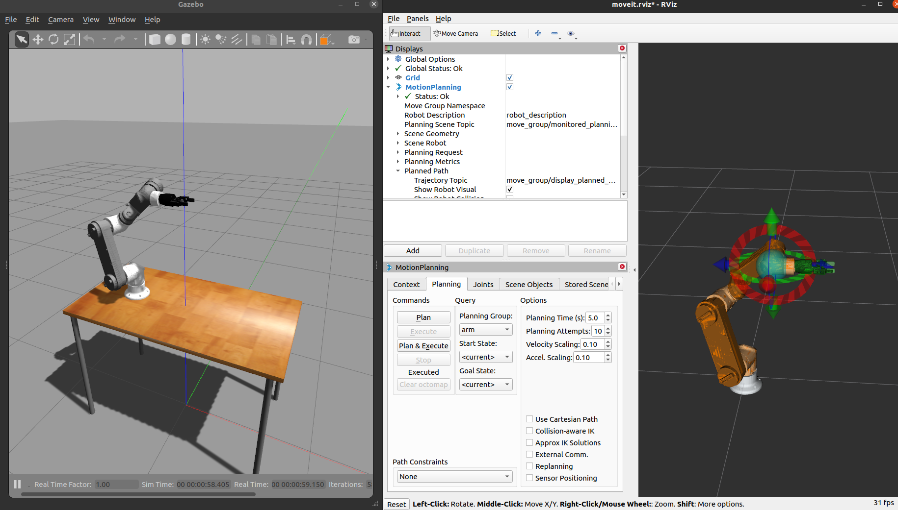

# OrangeWood Simulation Stack

This repository has a simulation and MoveIt! stack of indigenous OWL 6.5 Robot.

# Prerequisites

Here are the prerequisites to run the Gazebo simulation

* [Ubuntu 20.04.6 LTS](https://releases.ubuntu.com/focal/)
* [ROS Noetic Full Desktop Full](https://wiki.ros.org/noetic/Installation/Ubuntu) , you can also use [Single line installation](https://github.com/qboticslabs/ros_install_noetic) which is given below


ROS Noetic Single line installation
```
wget -c https://raw.githubusercontent.com/qboticslabs/ros_install_noetic/master/ros_install_noetic.sh && chmod +x ./ros_install_noetic.sh && ./ros_install_noetic.sh
```

# Setting Orangewood simulation on Host PC

We have two methods to test and work with simulation. 

* Setup in your host Ubuntu 20.04.6 machine 
* Setup  in [Docker](https://www.docker.com/). 

If you want to setup in host PC, you can follow this instruction.

**Note: If you want to install Docker and run simulation, jump to the last section.**

---------------------------------

## Setting ROS Workspace for Simulation

We have to create a ROS workspace to build the workspace. 

```
mkdir -p ~/orangewood_ws/src

cd ~/orangewood_ws/src

git clone https://github.com/orangewood-co/orangewood_sim_stack.git

cd ~/orangewood_ws

#Installing depdencies 

rosdep install --from-paths src --ignore-src -r -y

#Building packages

catkin_make -j1

echo "source ~/orangewood_ws/devel/setup.bash" >> /home/$USER/.bashrc

source /home/$USER/.bashrc
```

# Repository File Structure


# Running instruction: OWL 6.5 Robot
After setting the repository, we can run the Gazebo

**Terminal 1:**

Start Gazebo simulation of OWL 6.5 + Robotiq 2F 85 Gripper

```
roslaunch owl_bringup bringup.launch gripper:=robotiq2f85 world:=table  camera:=on sim:=on time:=5
```

Here are the list of options in the gripper: 

1) pneumatic 
2) vacuum
3) robotiq2f85

Here are the list of options in the world: 

1) empty
2) stand
3) table

Here are the options for the camera

1) on
2) off

Here are the options for sim. This option enable or disable Gazebo and only run MoveIt config in fake mode

1) on
2) off


Here are the options for time. 

This time mention when to start MoveIt config after simulation. If you are running without simulation, you can set this as 0. The value is in sec. 





# Setting OWL Robot SDK 

The OWL Robot SDK is simple API built on moveit_commander module from MoveIt. The APIs enable the developers to quickly test their application without much difficulty in understanding MoveIt APIs

## Installing OWL Robot SDK

The following command can install OWL Robot SDK

```
pip install owl-robot-sdk
```

## Run example of OWL Robot SDK

Make sure you are running, gazebo with MoveIt using above commands, if it is running, navigate to


*orangewood_simstack/owl/owl_robot_sdk/examples/api_test.py*

Run it using following command

```
python3 api_test.py
```

You can see various test being performed. If there is any failure, report to developers


# Setting Orangewood simulation on Docker

In order to setup Docker in your machine, first clone the orangewood simstack in your host machine


```
mkdir -p ~/orangewood_ws/src

cd ~/orangewood_ws/src

git clone https://github.com/orangewood-co/orangewood_sim_stack.git

cd ~/orangewood_ws/src/orangewood_simstack/docker/
```

## Install Docker in Host Machine

```
orangewood_simstack/docker$ ./setup_host_machine.sh
```

It will take some time to install Docker and NVIDIA Container toolkit

After installing everything, do a REBOOT of your PC

## Build Docker Image of Orangewood Simulation

```
orangewood_simstack/docker$ ./build_image.bash
```

## Run Docker for running simulation

```
orangewood_simstack/docker$ ./run_image.bash
```

After getting the terminal, follow the commands to build the ROS package and install depdencies

```
root@025d7e913e06:/home/robot/orangewood_ws# rosdep install --from-paths src --ignore-src -r -y


#Building packages

root@025d7e913e06:/home/robot/orangewood_ws# catkin_make


#Source workspace

root@025d7e913e06:/home/robot/orangewood_ws# source devel/setup.bash


# Run OWL 6.5 Simulation
roslaunch owl_bringup bringup.launch gripper:=robotiq2f85 world:=table  camera:=on sim:=on time:=5
```

You can take next docker session from next host terminal. Switch to docker folder and execute the following command

```
orangewood_simstack/docker$ ./new_sim_session.bash

root@025d7e913e06:/home/robot/orangewood_ws# source devel/setup.bash

root@025d7e913e06:/home/robot/orangewood_ws# roslaunch owl_moveit_bringup bringup.launch gripper:=robotiq2f85

```

Now you can set the pose of the end effector using marker, and press Plan & Execute

## Testing SDK Example

Take a new session and you can try the owl_robot_sdk/*example/api_test.py*

